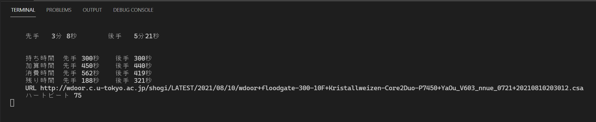

# shogi-watch-view

  

カウント・ダウンしない将棋タイマー（＾～＾）  
.csa 棋譜から算出（＾～＾）  
電竜戦、 floodgate に対応（＾～＾） 対応してなかったら直せ（＾～＾）  
フィッシャークロック・ルールのみ対応、秒読み無理（＾～＾）  

## Set up

main.py ファイルの中に URL をハードコーディングするところがあるから、そこを上書きしろだぜ（＾～＾）  

```plain
# 電竜戦
# csaFile = CsaFile.load('denryu-sen', 'https://golan.sakura.ne.jp/denryusen/dr2_tsec/kifufiles/～長い名前～.csa')
                          ~~~~~~~~~~
                          電竜戦

# floodgate
csaFile = CsaFile.load('floodgate', 'http://wdoor.c.u-tokyo.ac.jp/shogi/LATEST//2021/08/10/～長い名前～.csa')
                        ~~~~~~~~~                                       ~~~~~~
                        フラッドゲート                                    view は間違い
```

電竜戦と floodgate で細かく違うから 両方で動作テストしろだぜ（＾～＾）  

## Run

```shell
python main.py
```

## References

[PythonでWeb上のデータを読み込む：urlopen()](https://uxmilk.jp/23004)  
